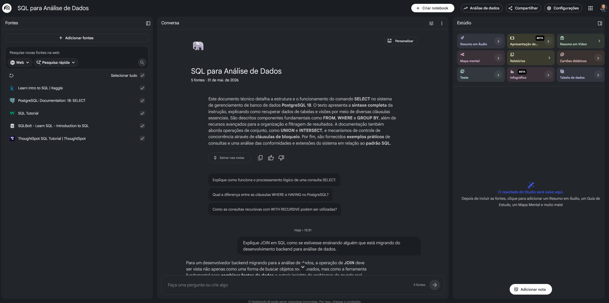
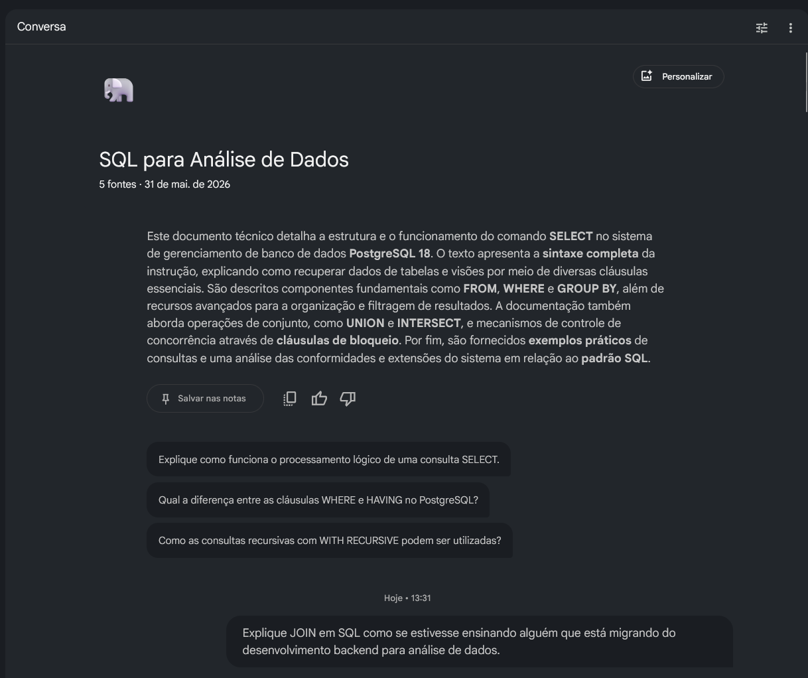
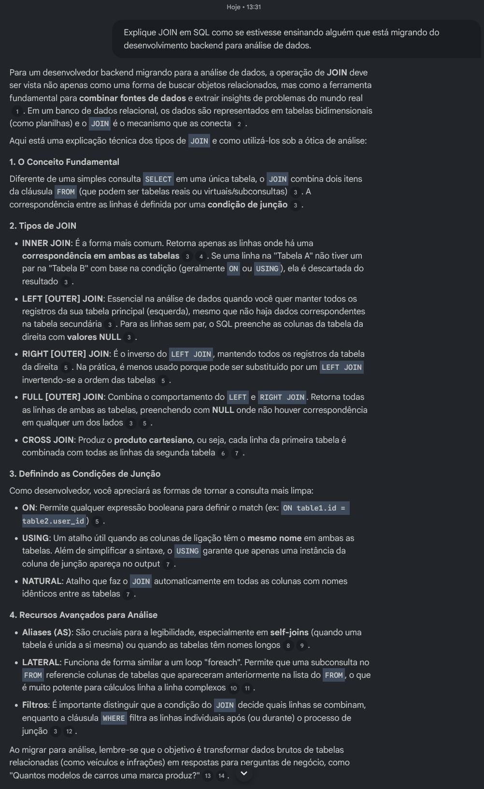

# Mini Guia de Estudos — SQL para Análise de Dados com NotebookLM

## Sobre o Projeto

Este projeto foi desenvolvido como parte do desafio prático da DIO com foco no uso da Inteligência Artificial como ferramenta de aprendizagem ativa utilizando o NotebookLM.

O tema escolhido foi:

# SQL para Análise de Dados e Business Intelligence

A proposta foi utilizar o NotebookLM como apoio para estudo, organização de conteúdo e consolidação de conhecimento técnico por meio de fontes abertas, engenharia de prompts e geração de resumos estruturados.

---

# Objetivos de Estudo

Este caderno temático teve como principais objetivos:

* Revisar fundamentos essenciais de SQL;
* Consolidar conceitos de consultas relacionais;
* Entender JOINs aplicados em análise de dados;
* Praticar agregações com `GROUP BY`, `COUNT`, `SUM` e `AVG`;
* Construir material reutilizável para futuras revisões;
* Explorar o NotebookLM como ferramenta de apoio ao aprendizado técnico.

---

# Curadoria de Fontes

As seguintes fontes foram utilizadas como base no NotebookLM:

### 1. PostgreSQL Documentation

https://www.postgresql.org/docs/current/sql-select.html

### 2. W3Schools SQL Tutorial

https://www.w3schools.com/sql/

### 3. Mode Analytics SQL Tutorial

https://mode.com/sql-tutorial/

### 4. SQLBolt

https://sqlbolt.com/

### 5. Kaggle Learn SQL

https://www.kaggle.com/learn/intro-to-sql

## Visualização das Fontes no NotebookLM

Abaixo estão as fontes utilizadas durante o estudo dentro do NotebookLM:



---

# Engenharia de Prompts

Durante o estudo, foram realizados testes com diferentes prompts para melhorar a qualidade das respostas geradas pela IA.

## Prompt 1

```text
Explique JOIN em SQL como se estivesse ensinando alguém que está migrando do backend para análise de dados.
```

---

## Prompt 2

```text
Qual a diferença prática entre INNER JOIN, LEFT JOIN e RIGHT JOIN com exemplos reais?
```

---

## Prompt 3

```text
Crie exercícios de SQL com foco em GROUP BY e HAVING voltados para análise de vendas.
```

---

## Prompt 4

```text
Resuma os comandos SQL mais utilizados em Business Intelligence.
```

---

## Prompt 5

```text
Monte um glossário com os principais conceitos de SQL usados em BI.
```
## Exemplo de Prompt Aplicado

Durante o processo foram testadas diferentes estratégias de prompts para aprofundar o conteúdo.



---

# Aprendizados e Dificuldades ("Cicatrizes")

Durante a execução do projeto alguns desafios apareceram:

## Respostas muito genéricas

Em alguns testes iniciais a IA trouxe explicações muito amplas.

### Solução:

Melhorei os resultados trazendo contexto mais específico nos prompts.

Exemplo:

Ao invés de perguntar:

```text
Explique GROUP BY
```

Passei a perguntar:

```text
Explique GROUP BY com exemplos voltados para dashboards de vendas e análise de negócio
```

Isso trouxe respostas muito mais práticas e aplicáveis.

---

# Miniguia de Estudo

# Resumo Estruturado

## SELECT

Utilizado para consultar dados dentro de tabelas.

---

## WHERE

Aplica filtros nas consultas.

---

## ORDER BY

Ordena os resultados retornados.

---

## GROUP BY

Agrupa registros para análise consolidada.

---

## COUNT()

Conta registros.

---

## SUM()

Soma valores numéricos.

---

## AVG()

Calcula médias.

---

## JOIN

Permite relacionar tabelas diferentes através de uma chave em comum.

---

# Glossário

## INNER JOIN

Retorna apenas registros que existem em ambas as tabelas.

## LEFT JOIN

Retorna todos os registros da tabela da esquerda e os correspondentes da direita.

## RIGHT JOIN

Retorna todos os registros da tabela da direita.

## GROUP BY

Agrupa registros com base em um ou mais campos.

## HAVING

Filtra dados agrupados após o `GROUP BY`.

## COUNT

Contagem de registros.

## SUM

Somatório de valores.

## AVG

Cálculo de média.

---

# Prompts Reutilizáveis para Revisão

## Revisão rápida

```text
Resuma este conteúdo em 10 tópicos principais.
```

---

## Explicação prática

```text
Explique esse conceito com exemplos reais de negócio.
```

---

## Exercícios

```text
Crie 5 exercícios práticos sobre esse tema com gabarito.
```

---

## Preparação para entrevistas

```text
Quais perguntas técnicas podem ser feitas sobre esse tema em entrevistas?
```

---
## Exemplo de Resposta Gerada

Abaixo está um exemplo de resposta produzida pelo NotebookLM com base nas fontes e prompts utilizados:



# Conclusão

Este projeto mostrou como o NotebookLM pode apoiar o aprendizado técnico por meio da organização de conteúdo, síntese de informação e engenharia de prompts.

Além do aprofundamento em SQL para análise de dados, o desafio também reforçou a importância da curadoria de fontes e da construção de prompts mais específicos para obter respostas mais úteis da IA.

---

# Tecnologias e Ferramentas Utilizadas

* NotebookLM
* GitHub
* Markdown
* SQL
* PostgreSQL
* Inteligência Artificial aplicada ao aprendizado

---
